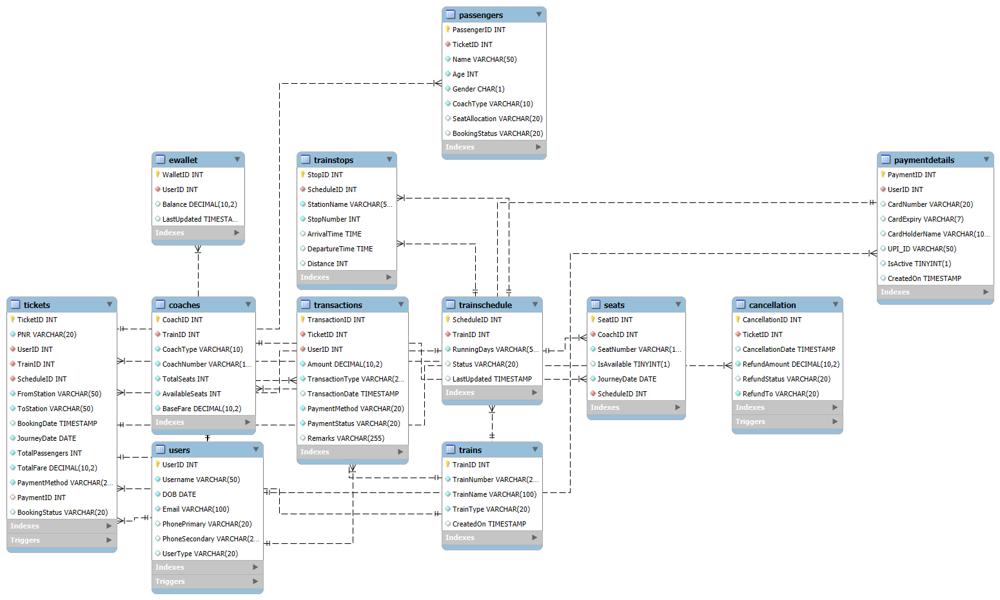
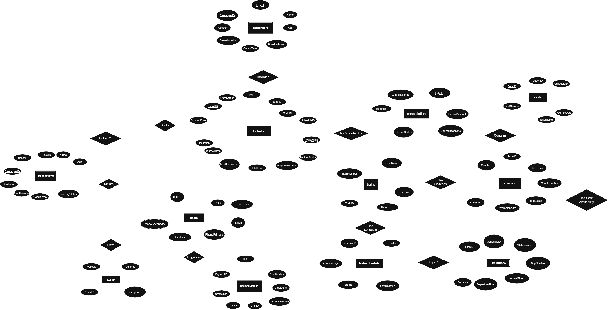

# 🚆 INDIAN RAILWAY SYSTEM

An SQL-based simulation of the Indian Railway Ticketing System, built with stored procedures, triggers, and a comprehensive relational schema to mimic real-world functionalities like booking, cancellations, wallet management, and admin control.

## 🧩 Entity-Relationship (ER) Model

The ER diagram below illustrates the database design and relationships between key tables in the system:

## 🧾 PROJECT DESCRIPTION

This project replicates the Indian Railways' booking infrastructure. It features:

- User registration, authentication, and wallet-based transactions
- Train search, seat booking with RAC/WL management
- Automatic seat promotion on cancellations
- Admin operations for populating and managing train data

---

## 📦 SETUP INSTRUCTIONS

1. *Database Setup*:  
   Execute the SQL scripts (train.docx contents) in your MySQL Workbench or CLI to create all tables, triggers, and procedures.

2. *Initial Train Data*:  
   Train and coach data are inserted as part of the setup. You can use CALL sp_PopulateSeatsForDate('YYYY-MM-DD'); to generate daily seat data.

---

## 👤 USER FUNCTIONS

| Feature                        | Procedure               | Description                                                  |
|-------------------------------|--------------------------|--------------------------------------------------------------|
| Register New User             | sp_CreateUser         | Create user and insert payment details                       |
| Login                         | sp_UserLogin          | Authenticate user using username + DOB (as password)         |
| Add Payment Method            | sp_AddPaymentMethod   | Add card or UPI credentials                                  |
| Load Wallet                   | sp_WalletOperation    | Use with operation = 'add' to load balance                 |
| Search Trains                 | sp_SearchTrains       | Search trains between stations on a date                     |
| Check Train Availability      | sp_TrainAvailability  | View timing, schedule, and stops                             |
| Book Ticket                   | sp_BookTicket1        | Book seat; auto-assigns Confirmed, RAC or WL                 |
| View Bookings                 | sp_ViewUserBookings   | Filter by status and journey date                            |
| Check PNR Status              | (use Tickets table)   | Check via PNR column in Tickets                          |
| Cancel Ticket                 | sp_CancelTicket       | Auto-promotes RAC/WL and refunds to wallet or original method |
| Logout                        | sp_UserLogout         | Dummy call for session end                                   |

> *Note*:
> - Refunds: 90% of fare refunded on cancellation  
> - RAC → Confirmed and WL → RAC on cancellations  
> - Ensure wallet balance is sufficient before booking

---

## 🛠 ADMINISTRATOR PANEL

| Task                            | SQL / Procedure                 | Description                                        |
|---------------------------------|----------------------------------|----------------------------------------------------|
| Generate Seats for Today       | CALL sp_GenerateSeats();      | Creates default seat layout for all coaches        |
| Populate Seats for a Date      | CALL sp_PopulateSeatsForDate('YYYY-MM-DD'); | Create seat entries for future dates              |
| Add New Train / Schedule       | INSERT INTO Trains ... etc.   | Add entries to Trains, TrainSchedule, etc.     |
| View All Tickets               | SELECT * FROM Tickets;        | View every booking                                 |
| View All Passengers            | SELECT * FROM Passengers;     | Individual passenger details                       |
| View All Transactions          | SELECT * FROM Transactions;   | Payment and refund history                         |
| View Wallets and Balances      | SELECT * FROM EWallet;        | Track wallet balance per user                      |
| View Cancellations             | SELECT * FROM Cancellation;   | Check refund info and cancellation logs            |

---

## ⚙ INTERNAL LOGIC (Triggers)

- trg_create_ewallet: Creates a wallet when user registers
- trg_process_refund: Auto-refunds wallet on cancellation
- trg_wallet_payment: Deducts from wallet during booking
- trg_update_passenger_status: Marks passengers as cancelled when ticket is cancelled

---

## 🧭 HOW TO USE (User Journey)

1. Register a new user using sp_CreateUser
2. Add funds using sp_WalletOperation
3. Search trains with sp_SearchTrains
4. Check stops and timings using sp_TrainAvailability
5. Book using sp_BookTicket1
6. View your tickets with sp_ViewUserBookings
7. Cancel using sp_CancelTicket if needed

---

🔍 Stored Procedures 
ListPassengersOnTrain(trainID, journeyDate)
→ Lists all passengers booked on a specific train for a given journey date.

GetWaitlistedPassengers(trainID)
→ Retrieves all waitlisted passengers for the specified train.

RefundableAmountForTrainCancellation(trainID, journeyDate)
→ Calculates refundable amount as: total revenue minus refunded amount for that train on a given date.

RevenueFromBookings(startDate, endDate)
→ Returns total ticket booking revenue generated within the specified date range.

BusiestRoute()
→ Finds the most traveled route (FromStation → ToStation) based on total passenger count.

ItemizedBill(ticketID)
→ Generates a bill for the ticket showing base fare and additional charges breakdown.

---

## 🔮 FUTURE IMPROVEMENTS

- ✅ Multi-passenger ticket booking support
- ✅ Email/SMS simulation for PNR alerts
- ⏳ Auto-scheduling of seats for future days via scheduler event
- ❌ Authentication with encrypted password support (currently DOB-based)
- 📈 Admin dashboard (GUI/Web or CLI-based)
- 📦 Integration with live train data APIs (IRCTC/NTES)
- 🧠 AI-assisted dynamic pricing (e.g., surge fare, route popularity)
- 🔐 Session-based authentication & token management

---

## 📄 LICENSE

This project is free to use for educational purposes.

---
