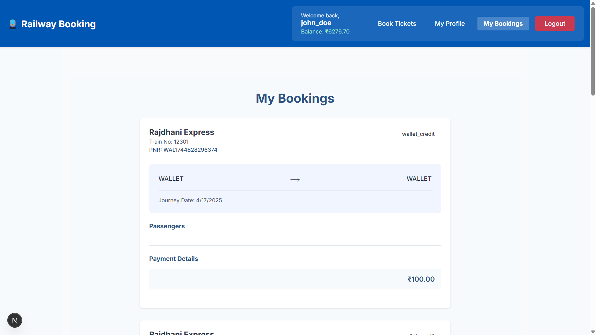
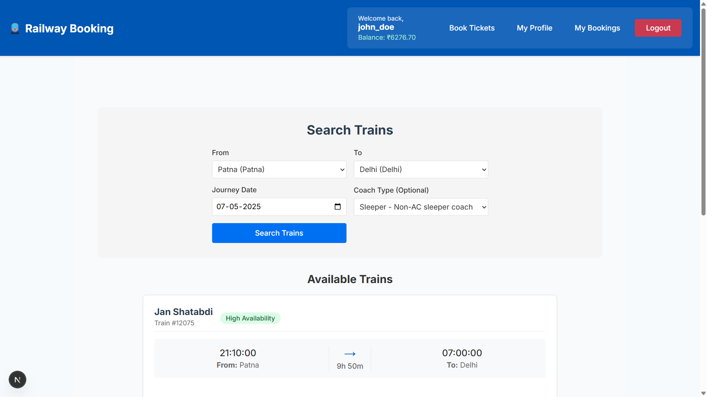
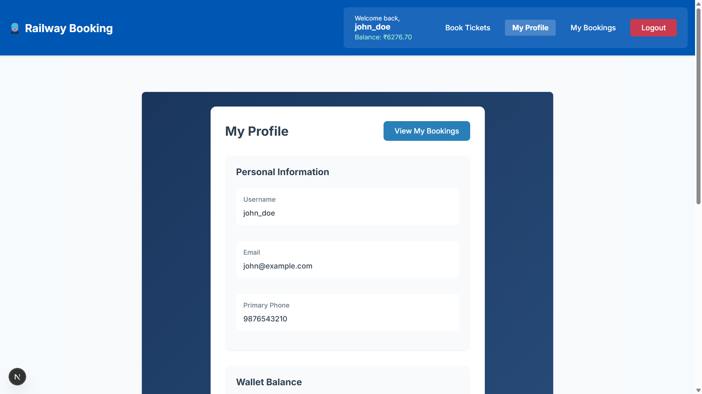
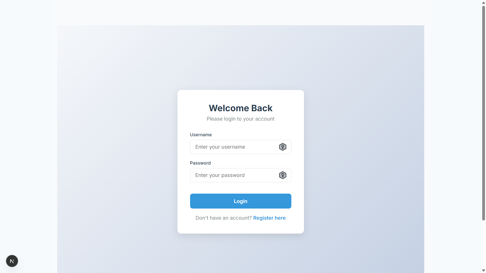

# Railway Reservation System

A comprehensive simulation of the Indian Railway Ticketing System built with MySQL, featuring stored procedures, triggers, and a relational database schema to implement real-world functionalities including reservations, cancellations, payment processing, and administrative controls.

## Entity-Relationship (ER) Model

The diagram below illustrates the database design and relationships between entities in the system:

## Project Overview

This project implements a digital replica of the Indian Railways' reservation infrastructure with the following features:

- User account management with secure authentication
- Electronic wallet for seamless transactions
- Advanced train search functionality
- Reservation system with automatic seat allocation
- Support for RAC (Reservation Against Cancellation) and Waitlist management
- Dynamic seat promotion upon cancellations
- Administrative interface for system management

---

## Setup Instructions

1. **Database Initialization**:
   - Execute the SQL scripts in MySQL Workbench or command-line interface to create the database schema, including tables, triggers, and stored procedures.

2. **Data Population**:
   - Initial train and coach data are included in the setup scripts.
   - Generate daily seat inventory using: `CALL sp_PopulateSeatsForDate('YYYY-MM-DD');`

---

## User Functionality

| Feature | Procedure | Description |
|---------|-----------|-------------|
| Account Registration | sp_CreateUser | Creates a new user account and associated payment details |
| Authentication | sp_UserLogin | Authenticates users with credentials |
| Payment Method Registration | sp_AddPaymentMethod | Registers card or UPI payment methods |
| Wallet Management | sp_WalletOperation | Manages wallet balance (add funds) |
| Train Search | sp_SearchTrains | Searches available trains between stations for a specific date |
| Availability Check | sp_TrainAvailability | Displays train schedule, timing, and stops |
| Ticket Booking | sp_BookTicket1 | Books seats with automatic allocation to Confirmed, RAC, or Waitlist |
| Booking History | sp_ViewUserBookings | Views bookings filtered by status and travel date |
| PNR Status | Tickets table query | Retrieves booking status via PNR |
| Cancellation | sp_CancelTicket | Processes cancellations with automatic seat reallocation and refunds |
| Session Management | sp_UserLogout | Terminates user session |

> **Notes**:
>
> - Cancellation policy: 90% of fare is refunded
> - Seat allocation automatically promotes RAC to Confirmed and Waitlist to RAC upon cancellations
> - Sufficient wallet balance is required for booking transactions

---

## Administrative Functions

| Function | Implementation | Description |
|----------|----------------|-------------|
| Daily Seat Generation | CALL sp_GenerateSeats(); | Creates seat inventory for all coaches |
| Scheduled Seat Creation | CALL sp_PopulateSeatsForDate('YYYY-MM-DD'); | Prepares seat inventory for future dates |
| Train Management | SQL INSERT statements | Adds or modifies train details and schedules |
| Reservation Monitoring | SELECT * FROM Tickets; | Views all booking records |
| Passenger Management | SELECT * FROM Passengers; | Retrieves passenger details |
| Transaction Records | SELECT * FROM Transactions; | Monitors payment and refund history |
| Financial Oversight | SELECT * FROM EWallet; | Tracks user wallet balances |
| Cancellation Tracking | SELECT * FROM Cancellation; | Reviews cancellation data and refund processing |

---

## System Architecture (Triggers)

- **trg_create_ewallet**: Automatically creates a wallet for new user registrations
- **trg_process_refund**: Processes refunds to wallet upon ticket cancellation
- **trg_wallet_payment**: Manages wallet balance deduction during booking
- **trg_update_passenger_status**: Updates passenger status during cancellation

---

## Usage Guide

1. Register an account using `sp_CreateUser`
2. Add funds to wallet using `sp_WalletOperation`
3. Search for available trains with `sp_SearchTrains`
4. Review train details with `sp_TrainAvailability`
5. Book tickets using `sp_BookTicket1`
6. View bookings with `sp_ViewUserBookings`
7. Cancel reservations if needed with `sp_CancelTicket`

---

## Advanced Analytics

- **ListPassengersOnTrain(trainID, journeyDate)**: Generates passenger manifest for specific trains
- **GetWaitlistedPassengers(trainID)**: Retrieves waitlist information for capacity planning
- **RefundableAmountForTrainCancellation(trainID, journeyDate)**: Calculates financial impact of train cancellations
- **RevenueFromBookings(startDate, endDate)**: Provides revenue analytics for specified periods
- **BusiestRoute()**: Identifies high-traffic routes based on passenger volume
- **ItemizedBill(ticketID)**: Generates detailed fare breakdown for tickets

---

## Development Roadmap

| Feature | Status | Description |
|---------|--------|-------------|
| Multi-passenger Booking | ✅ Implemented | Support for booking multiple passengers on a single ticket |
| Notification System | ✅ Implemented | Simulated alerts for booking and PNR status updates |
| Automated Scheduling | ⏳ In Progress | Automatic seat inventory generation for future dates |
| Enhanced Authentication | ❌ Planned | Secure password encryption (replacing DOB-based authentication) |
| Administrative Dashboard | 📈 Planned | Graphical interface for system management |
| External API Integration | 📦 Planned | Connection with live train data services |
| Dynamic Pricing Model | 🧠 Planned | Intelligent fare calculation based on demand and route popularity |
| Session Management | 🔐 Planned | Token-based authentication with session control |

---

## License

This project is available for educational purposes under the MIT License.

## Application Interface

## Repository

[GitHub Repository](https://github.com/01prakash-aditya/Railway_Booking_System)
